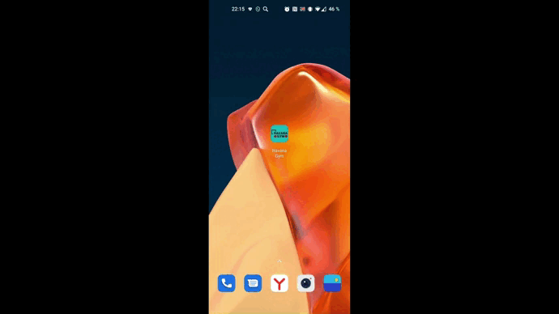
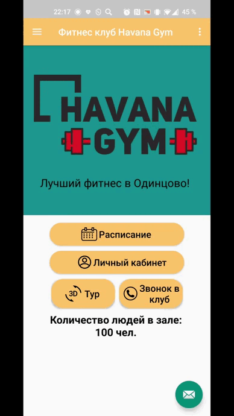
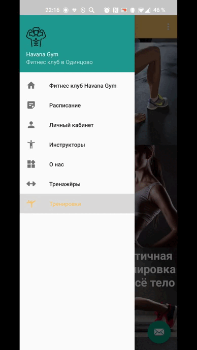
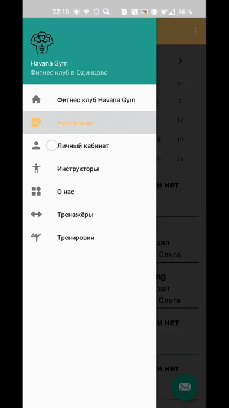

# Android App Havana Gym (приложение для фитнес центра)

## 1. Основная идея
Мобильное Android приложение Havana Gym с применением дополненной реальности для фитнес центра Havana Gym. 

## 2. ⚠️ Системные и аппаратные требования к смартфону

### 2.1 Платформа клиентских частей приложения:
• Android - версия 5.0 и выше.

### 2.2 Доступ к сети Интернет.

### 2.3 Мобильное устройство должно поддерживать портретную и ландшафтную ориентацию (для видео контента).

### 2.4 Для AR-модуля:
• Android - версия 10.0 и выше;
• Устройство должно быть совместимо с ARCore (список можно просмотреть
в перечне поддерживаемых устройств https://developers.google.com/ar/dev).

### 2.5 Разрешения: какие разрешения приложение будет просить у пользователя.
Разрешение впервые должно запрашиваться на экране, на котором оно используется:
• Чтение сервисных SMS - для чтения пароля при авторизации;
• Доступ к сети Интернет;
• Доступ к камере – для использования AR модуля;
• Доступ к телефону – для звонков и WhatsApp.

## 3. Использование проекта
### 3.1 Быстрый старт 

```
Скачайте Android Studio->загрузите zip-файл или папку git clone'App_Havana'-> Откройте проект с помощью Android Studio-> подключитесь к своему телефону для компиляции с помощью USB
```

### 3.2 Демонстрация работы приложения
После запуска приложения открывается его главная страница, которая содержит одноименные кнопки «Расписание», «Личный кабинет», «3D тур», «Звонок в клуб», по которым можно перейти на соответствующие страницы приложения.
Значок письма в правом нижнем углу переносит на диалог с фитнес клубом в приложении WhatsApp. 
Внизу экрана можно увидеть изменяющееся количество людей в клубе. 
Нажав на три полоски в левом верхнем углу экрана главной страницы, выпадет боковое меню приложения, которое содержит переходы на все другие страницы.

#### 3.2.1 Расписание тренировок
На страницу расписания перейти можно как из главной страницы, так и из бокового меню приложения. Данная страница содержит календарь групповых тренировок фитнес клуба.


#### 3.2.2 Авторизация
Для того, чтобы попасть в личный кабинет, требуется авторизация с помощью СМС по номеру телефона. Сначала открывается страница, на которой требуется ввести номер телефона, а после открывается страница, на которой нужно ввести полученный код по СМС.

 

#### 3.2.3 3D-тур
На страницу интегрированного 3D тура можно перейти с главной страницы приложения. С помощью заданных точек можно перемещаться по
клубу и исследовать его, а также можно посмотреть презентацию клуба в формате видео.

 

#### 3.2.4 Звонок в клуб
Для того, чтобы позвонить в клуб, следует нажать на главной странице кнопку «Звонок в клуб», после появится всплывающее окно, в котором нужно разрешить приложению совершать звонки и управлять ими, после чего осуществиться вызов. Однако, если самостоятельно пользователь в настройках телефона запретит данному приложению доступ к вызовам, то для того, чтобы осуществить звонок потребуется самостоятельно давать доступ уже в настройках приложения.

 

#### 3.2.5 Инструкторы
Данная страница содержит список инструкторов фитнес клуба, а также подробную информацию о каждом инструкторе на отдельной странице. Также из бокового меню можно перейти на страницу о клубе.

 

#### 3.2.6 Тренажеры
На данной странице расположены тренажеры, их название, краткая информация, а также видео тренировки (обучение технике) и AR-приложение. При нажатии на кнопку «Тренировка» открывается видео обучение к данному тренажеру (техника выполнения).

При нажатии на кнопку «AR модель» всплывает окно, в котором требуется дать разрешение к камере для данного приложения, после чего открывается страница с отображением камеры мобильного телефона (важно помнить, что для запуска AR модели на данном устройстве должно быть установлено приложение «Сервисы Google Play для AR»). Далее нужно следовать инструкции анимации на экране, чтобы выделить поверхность (появятся точечки), на которую потом размещается сама модель тренажера дополненной реальности, данную модель можно увеличить\уменьшить, покрутить, обойти вокруг.

 

#### 3.2.7 Тренировки
На странице тренировок размещены разные виды тренировок, после нажатия на которые открывается аналогичный медиапроигрыватель с видео тренировкой.

 
